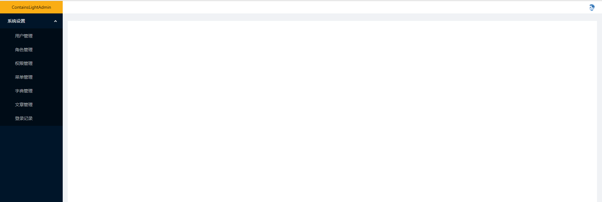
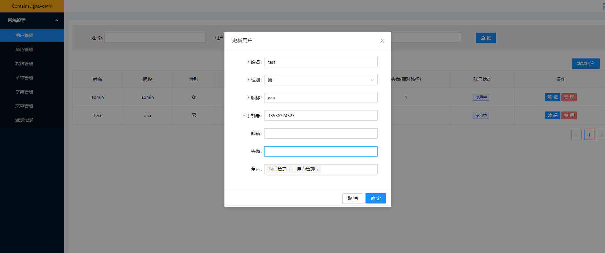
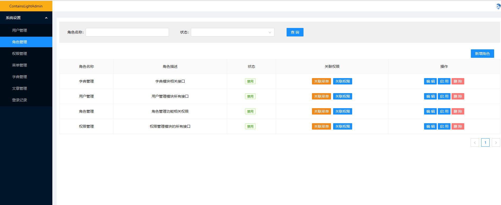
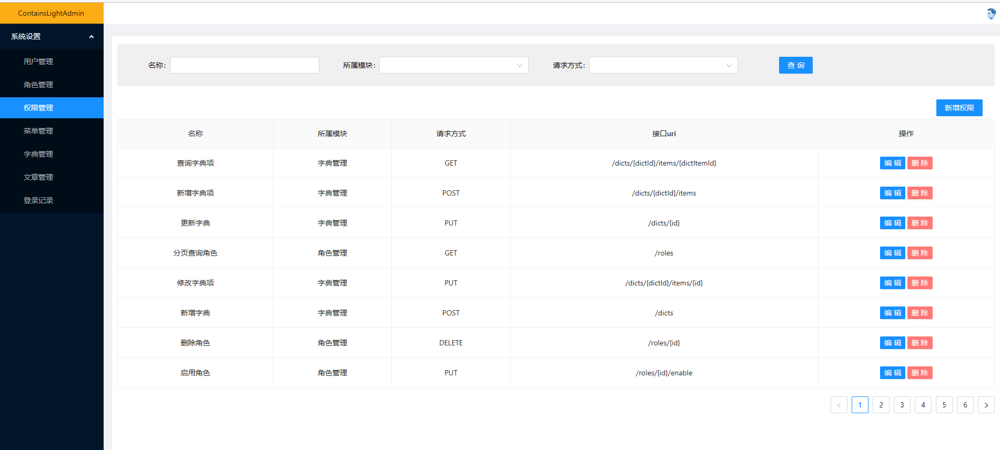
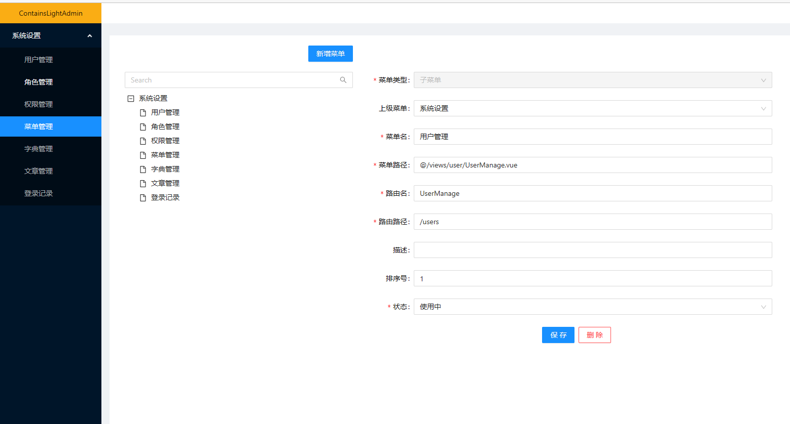
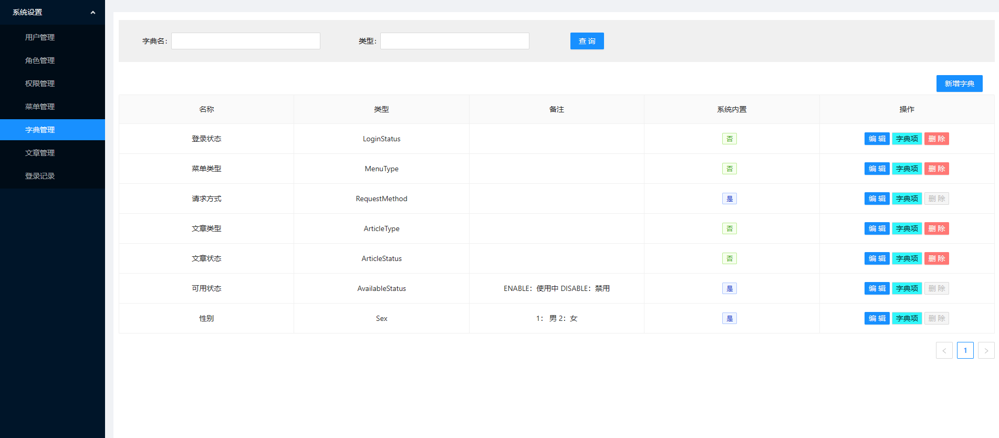
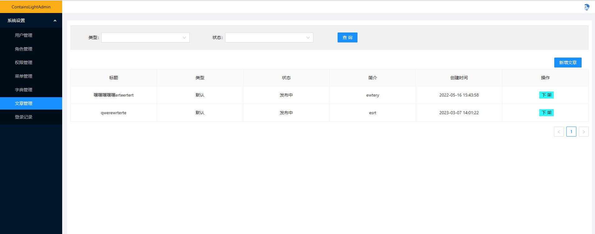
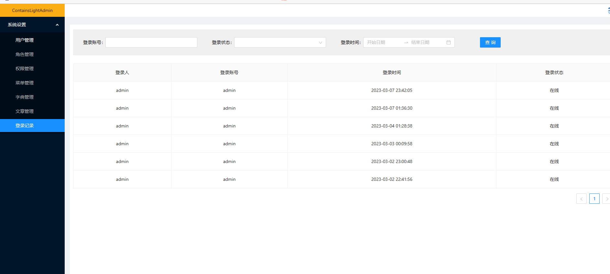

## 介绍
基于`JDK17`、`WebFlux`、`R2DBC`开发的后台管理系统。接口采用RESTful风格，并支持Docker多阶段构建。前端代码：https://github.com/NotEdibleSalt/ContainsLightAdmin

## 功能模块
- 用户管理
- 角色管理
- 权限管理
- 菜单管理
- 字典管理
- 文章管理
- 登录记录

## 页面展示

### 参考文档

* [Official Apache Maven documentation](https://maven.apache.org/guides/index.html)
* [Spring Boot Maven Plugin Reference Guide](https://docs.spring.io/spring-boot/docs/2.5.2/maven-plugin/reference/html/)
* [Create an OCI image](https://docs.spring.io/spring-boot/docs/2.5.2/maven-plugin/reference/html/#build-image)
* [Spring Data R2DBC](https://docs.spring.io/spring-boot/docs/2.5.2/reference/html/spring-boot-features.html#boot-features-r2dbc)
* [Spring Security](https://docs.spring.io/spring-boot/docs/2.5.2/reference/htmlsingle/#boot-features-security)
* [Spring Boot DevTools](https://docs.spring.io/spring-boot/docs/2.5.2/reference/htmlsingle/#using-boot-devtools)
* [Spring Configuration Processor](https://docs.spring.io/spring-boot/docs/2.5.2/reference/htmlsingle/#configuration-metadata-annotation-processor)
* [Validation](https://docs.spring.io/spring-boot/docs/2.5.2/reference/htmlsingle/#boot-features-validation)
* [Spring Data Reactive Redis](https://docs.spring.io/spring-boot/docs/2.5.2/reference/htmlsingle/#boot-features-redis)
* [Spring Boot Actuator](https://docs.spring.io/spring-boot/docs/2.5.2/reference/htmlsingle/#production-ready)
